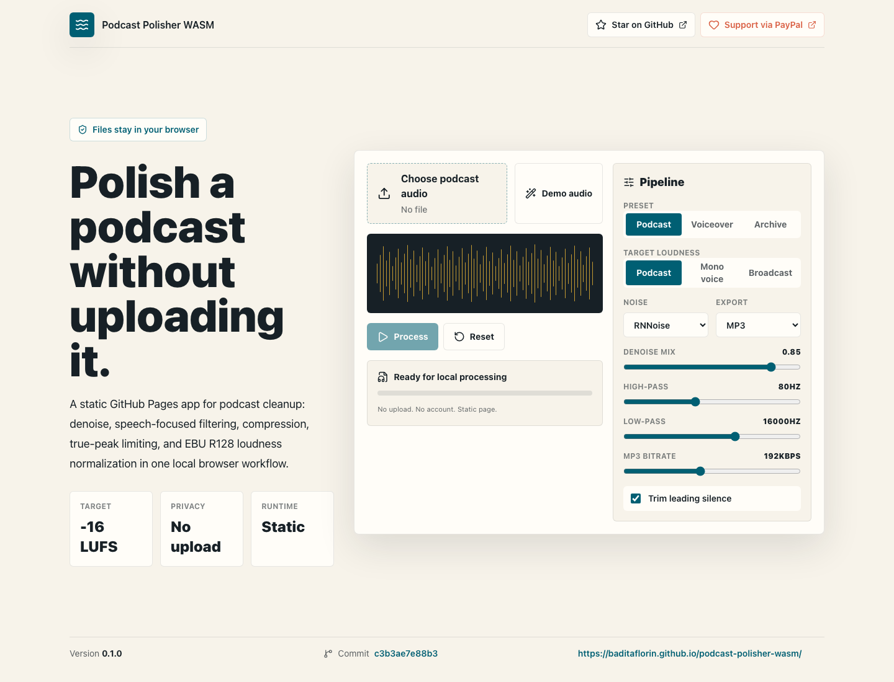
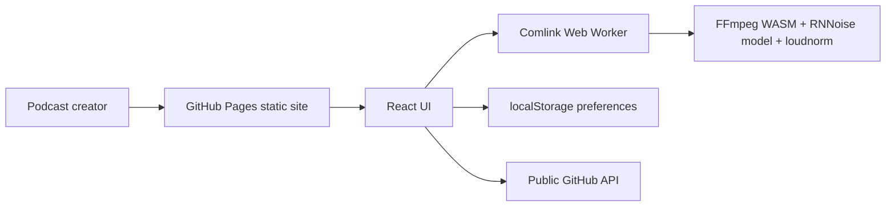

# Podcast Polisher WASM


Live site:

https://baditaflorin.github.io/podcast-polisher-wasm/

Repository:

https://github.com/baditaflorin/podcast-polisher-wasm

Support:

https://www.paypal.com/paypalme/florinbadita

Browser-only podcast post-production with RNNoise model-backed denoising, cleanup filters, EBU R128 loudness normalization, MP3/WAV export, provenance metadata, and reloadable state files. Files stay local in the browser; the public app is only static GitHub Pages assets.



## Quickstart

```bash
npm install
make install-hooks
make dev
make build
make smoke
```

## Architecture



## Pipeline

The v1 browser pipeline runs:

```text
decode -> highpass/lowpass -> RNNoise arnndn or afftdn -> compressor -> loudnorm two-pass EBU R128 -> true-peak limiter -> MP3/WAV export
```

FFmpeg WASM assets are lazy-loaded after user action, keeping the first load below the 200KB gzip budget.

## Usable Workflows

- Bring your own audio with the file picker, drag/drop, clipboard paste, or the built-in demo file.
- Select multiple files, inspect the queue, and switch which file to process.
- Export polished MP3/WAV audio, provenance metadata JSON, and a reloadable `.state.json` file.
- Import a `.state.json` file to restore settings and audit context. Audio bytes are not embedded, so choose the private source file again.
- Copy the current state JSON to the clipboard for support notes or automation handoff.

## Limitations

- No runtime backend, accounts, or uploads.
- No arbitrary media URL fetcher; browser CORS makes that unreliable on GitHub Pages.
- No process-all batch queue yet. Multi-file input is for selecting and switching the active file.
- Mobile file pickers are browser-dependent, though the app accepts common audio and video media types.

## Documentation

Architecture:

docs/architecture.md

ADRs:

docs/adr/

Deploy guide:

docs/deploy.md

Privacy:

docs/privacy.md

Postmortem:

docs/postmortem.md

Phase 3 postmortem:

docs/postmortem-phase3.md

Third-party notices:

THIRD_PARTY_NOTICES.md
