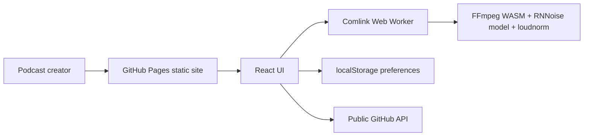

# Podcast Polisher WASM


Live site:

https://baditaflorin.github.io/podcast-polisher-wasm/

Repository:

https://github.com/baditaflorin/podcast-polisher-wasm

Support:

https://www.paypal.com/paypalme/florinbadita

Browser-only podcast post-production with RNNoise model-backed denoising, cleanup filters, EBU R128 loudness normalization, and MP3/WAV export. Files stay local in the browser; the public app is only static GitHub Pages assets.


## Quickstart

```bash
npm install
make install-hooks
make dev
make build
make smoke
```

## Architecture



## Pipeline

The v1 browser pipeline runs:

```text
decode -> highpass/lowpass -> RNNoise arnndn or afftdn -> compressor -> loudnorm two-pass EBU R128 -> true-peak limiter -> MP3/WAV export
```

FFmpeg WASM assets are lazy-loaded after user action, keeping the first load below the 200KB gzip budget.

## Documentation

Architecture:

docs/architecture.md

ADRs:

docs/adr/

Deploy guide:

docs/deploy.md

Privacy:

docs/privacy.md

Postmortem:

docs/postmortem.md

Third-party notices:

THIRD_PARTY_NOTICES.md
