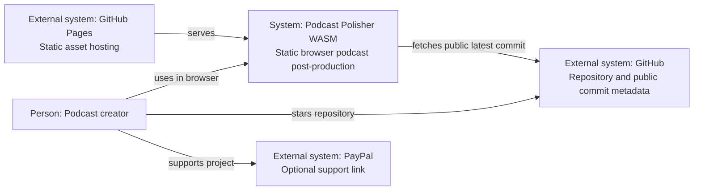
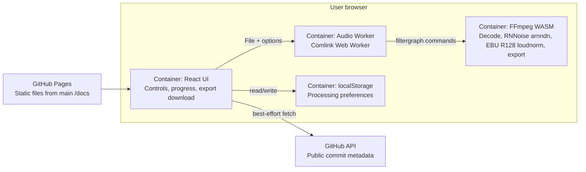

# Architecture

## C4 Context

## C4 Container

## Module Boundaries

- `app/src/features/processing/`: workbench UI.
- `app/src/lib/audio/`: options, command builder, demo WAV generation, worker client.
- `app/workers/`: FFmpeg worker.
- `docs/`: GitHub Pages output plus Markdown docs and ADRs.
- `scripts/`: local checks, preview server, release helper.
